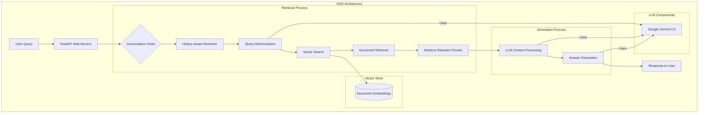
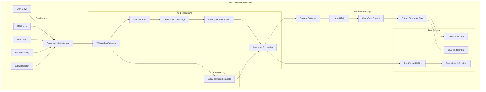
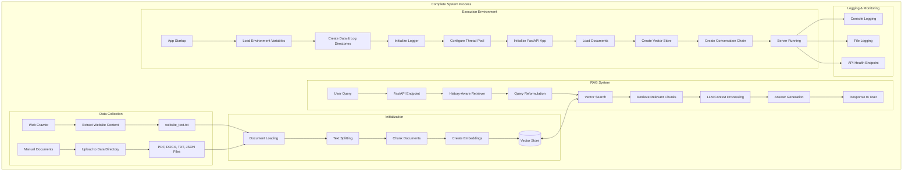

# Policy Search - Documentation

## Overview

This is a Retrieval-Augmented Generation (RAG) system designed to answer questions using information from various documents. The system uses the Google Gemini 2.0 Flash model with vector search to retrieve relevant information from the document collection and provide accurate answers to user queries.

## Project Structure

- `main.py` - FastAPI web application for handling API requests
- `chain.py` - LangChain chains for question answering and retrieval
- `helper_functions.py` - Utility functions including embedding creation
- `logger.py` - Logging configuration
- `config.py` - Configuration settings
- `.env` - Environment variables
- `data/` - Directory containing documents (PDF, DOCX, TXT)
- `logs/` - Directory for log files (created automatically)
- `requirements.txt` - Project dependencies
- `websiteParser.py`, `url_extractor.py`, `content_extractor_from_urls.py`, `run_scraper.py` - Web scraping utilities

## System Architecture

### 1. RAG Architecture



#### RAG Process Explained:

1. **User Query Flow**:
   - User submits a question through the FastAPI web service
   - The query is passed to the Conversation Chain which orchestrates the entire RAG process

2. **Retrieval Process**:
   - **History-Aware Retriever**: Considers previous interactions to understand context
   - **Query Reformulation**: Transforms ambiguous queries into explicit search terms using the LLM
   - **Vector Search**: Searches the vector database for semantically similar content
   - **Document Retriever**: Fetches the actual document chunks from storage
   - **Retrieve Relevant Chunks**: Selects the most relevant text chunks based on similarity scores

3. **Generation Process**:
   - **LLM Context Processing**: The LLM (Google Gemini 2.0) processes the retrieved text chunks
   - **Answer Generation**: Synthesizes an answer based solely on the provided context

4. **Vector Store**:
   - Contains dense vector embeddings of document chunks
   - Enables semantic search rather than just keyword matching

5. **LLM Integration**:
   - Google Gemini 2.0 is used for three critical functions:
     - Query reformulation: Improving search queries
     - Context processing: Understanding retrieved documents
     - Answer generation: Creating coherent responses

### 2. Web Crawler Architecture



#### Web Crawler Process Explained:

1. **Initialization**:
   - **Start Crawl**: Begins the crawling process
   - **Command Line Interface**: Accepts parameters like base URL, depth, delay, and output directory
   - **WebsiteTextExtractor**: Main class that orchestrates the crawling process

2. **URL Processing**:
   - **URL Extractor**: Identifies all links on a page
   - **Extract Links**: Parses HTML to find all hyperlinks
   - **Filter by Domain & Path**: Ensures only relevant URLs within the target domain are processed
   - **Queue for Processing**: Maintains a queue of URLs to visit

3. **Content Processing**:
   - **Content Extractor**: Extracts relevant text from web pages
   - **Parse HTML**: Converts HTML to a structured DOM
   - **Clean Text Content**: Removes boilerplate, ads, and irrelevant elements
   - **Extract Structured Data**: Identifies headers, paragraphs, lists, and other structured content

4. **Data Storage**:
   - **Save JSON Data**: Stores structured data with URLs as keys in JSON format
   - **Save Text Content**: Creates a consolidated text file of all extracted content
   - **Track Visited URLs**: Maintains history of processed URLs
   - **Save Visited URLs List**: Creates a record of all crawled pages

5. **Rate Limiting**:
   - Implements delay between requests to prevent server overload
   - Ensures ethical web scraping practices

6. **Configuration**:
   - **Base URL**: Starting point for the crawler
   - **Max Depth**: Limit on how many levels deep to crawl
   - **Request Delay**: Time to wait between requests
   - **Output Directory**: Where to store extracted data

### 3. Complete System Process



#### Complete System Process Explained:

1. **Data Collection**:
   - **Web Crawler**: Automatically extracts content from websites
   - **Manual Documents**: User-provided files (PDF, DOCX, TXT, JSON)
   - Both sources feed into the data directory for processing

2. **Initialization**:
   - **Document Loading**: Reads files from various formats
   - **Text Splitting**: Breaks documents into manageable chunks
   - **Chunk Documents**: Creates overlapping text segments for better context retention
   - **Create Embeddings**: Generates vector representations of text chunks
   - **Vector Store**: Stores these embeddings for efficient semantic search

3. **RAG System Operation**:
   - **User Query**: Receives question via API
   - **History-Aware Retriever**: Considers conversation context
   - **Query Reformulation**: Optimizes the query for search
   - **Vector Search**: Finds semantically similar content
   - **Retrieve Relevant Chunks**: Gets the most relevant document segments
   - **LLM Context Processing**: Processes retrieved information
   - **Answer Generation**: Creates response based only on retrieved context
   - **Response to User**: Returns the answer via API

4. **Execution Environment**:
   - **App Startup**: Initializes the application
   - **Load Environment Variables**: Reads API keys and configuration
   - **Create Directories**: Ensures data and log directories exist
   - **Initialize Logger**: Sets up the logging system
   - **Configure Thread Pool**: Prepares for concurrent processing
   - **Initialize FastAPI App**: Sets up the web server
   - **Load Documents**: Processes files from data directory
   - **Create Vector Store**: Builds the search index
   - **Create Conversation Chain**: Initializes the RAG pipeline
   - **Server Running**: System ready to accept queries

5. **Logging & Monitoring**:
   - **Console Logging**: Real-time feedback during operation
   - **File Logging**: Persistent record of system events
   - **API Health Endpoint**: Allows monitoring system status

#### Key Integration Points

1. **Data Flow Integration**:
   - Web crawler output feeds directly into the RAG system's document processing pipeline
   - Manual document uploads complement web-crawled content

2. **Processing Pipeline**:
   - Document chunking strategy directly impacts retrieval quality
   - Embedding quality determines search accuracy
   - Context window size limits affect answer synthesis

3. **Runtime Environment**:
   - Thread pool enables concurrent query processing
   - Error handling at multiple levels ensures system resilience
   - Resource management (memory, API calls) affects performance and cost

4. **System Modularity**:
   - Components can be upgraded independently (e.g., switching LLM providers)
   - Vector store can be persisted and reused across restarts
   - Logging provides debugging and optimization insights

## Requirements

- Python 3.8+
- Google API key with Gemini access
- Dependencies listed in requirements.txt

## Setup Instructions

1. **Clone the repository**

```bash
git clone <repository-url>
cd ODA_Policy_Search
```

2. **Set up a virtual environment**

```bash
# Windows
python -m venv policy
policy\Scripts\activate

# Linux/Mac
python -m venv policy
source policy/bin/activate
```

3. **Install dependencies**

```bash
pip install -r requirements.txt
```

4. **Configure environment variables**

Create or update your `.env` file with your Google API key:
```
GOOGLE_API_KEY=your_google_api_key
```

5. **Prepare your documents**

Place your documents in the `data/` directory. The system supports:
- PDF files (.pdf)
- Word documents (.docx)
- Text files (.txt)
- JSON files (.json)

You can either:
- Manually copy documents to the data directory, or
- Use the included web scraping tools to gather content (see Web Scraping section)

Note: The `data/` and `logs/` directories will be created automatically if they don't exist.

## Running the Application

1. **Start the API server**

```bash
python main.py
```

The server will start on http://0.0.0.0:3000 by default.

2. **Test the API**

You can test the API with a tool like curl or Postman:

```bash
curl -X POST http://localhost:3000/generate \
  -H "Content-Type: application/json" \
  -d '{"query":"What information can you provide about this topic?"}'
```

## API Endpoints

- **POST `/generate`**
  - Request body: `{"query": "your question here"}`
  - Response: `{"answer": "response from the model"}`
  - Used to ask questions about the content in your documents

- **GET `/health`**
  - Response: `{"status": "healthy", "timestamp": "2024-04-17T18:00:00.000000"}`
  - Health check endpoint

## Web Scraping Utilities

The project includes tools to scrape content from websites for use in the RAG system:

### Using the Web Scraper

```bash
python run_scraper.py --url "https://example.com/content" --depth 3 --delay 2.0 --output "./data"
```

Parameters:
- `--url`: Base URL to scrape (default: https://www.angelone.in/support)
- `--depth`: Maximum depth to crawl (default: 5)
- `--delay`: Delay between requests in seconds (default: 0.5)
- `--output`: Output directory for data (default: ./data)

### Web Scraper Components

- `websiteParser.py` - Main web scraping engine
- `url_extractor.py` - Extracts URLs from web pages
- `content_extractor_from_urls.py` - Extracts content from web pages
- `run_scraper.py` - Command-line interface for web scraping

The scraper generates these output files:
1. `website_data.json` - JSON file containing all extracted data
2. `website_text.txt` - Text file containing all extracted content
3. `visited_urls.txt` - List of all URLs visited during the crawl

## Troubleshooting

### Common Issues

1. **Unicode Errors**: If you experience unicode errors when loading text files, check that your files are correctly encoded (UTF-8 recommended).

2. **Google API Key**: Ensure your Google API key has access to the Gemini models and is correctly set in your .env file.

3. **Document Processing**: If documents aren't being processed correctly, check the logs for specific error messages.

4. **Memory Issues**: Large documents may require more memory. Consider adjusting chunk sizes in the code if you encounter memory problems.

5. **File Permissions**: Ensure that the application has write permissions for the `logs/` directory to create log files.

6. **Docker Deployment**: When deploying with Docker, make sure to correctly mount volumes for the `data/` and `logs/` directories.

## Advanced Configuration

You can adjust several parameters in the code:

- `MAX_WORKERS`: Controls the number of concurrent threads (default: 4)
- Chunk size and overlap in `RecursiveCharacterTextSplitter` (default: 1200/300)
- Retriever search parameters (default k=30)
- Server port (default: 3000)